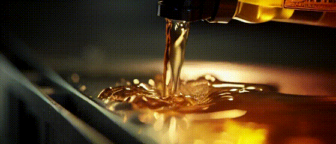

# Vchitect/SEINE Cog model

This is an implementation of [Vchitect/SEINE](https://github.com/Vchitect/SEINE) as a [Cog](https://github.com/replicate/cog) model.

## Development

Follow the [model pushing guide](https://replicate.com/docs/guides/push-a-model) to push your own model to [Replicate](https://replicate.com).

## Basic Usage

Download weights first

    cog run python script/download_weights.py

Then for predictions,

    cog predict -i image=@demo.png

# Example

